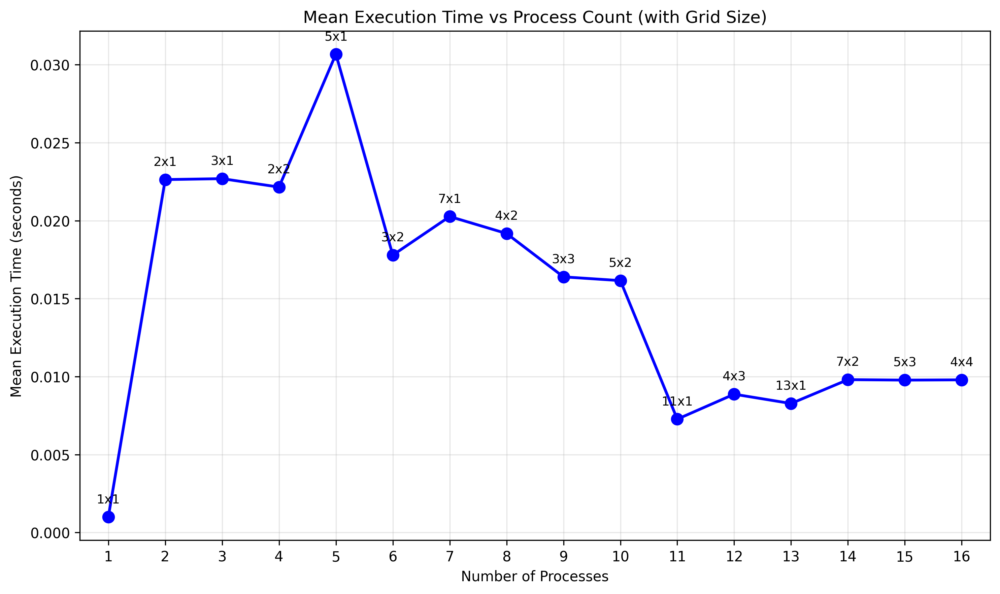
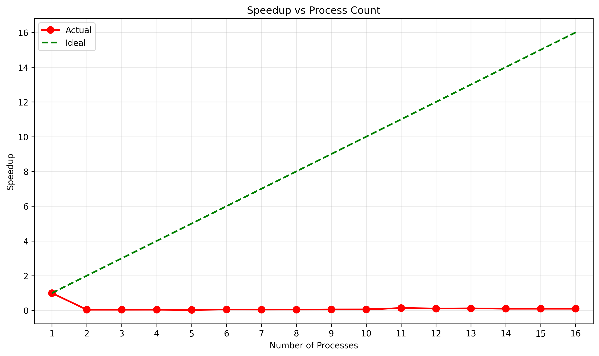
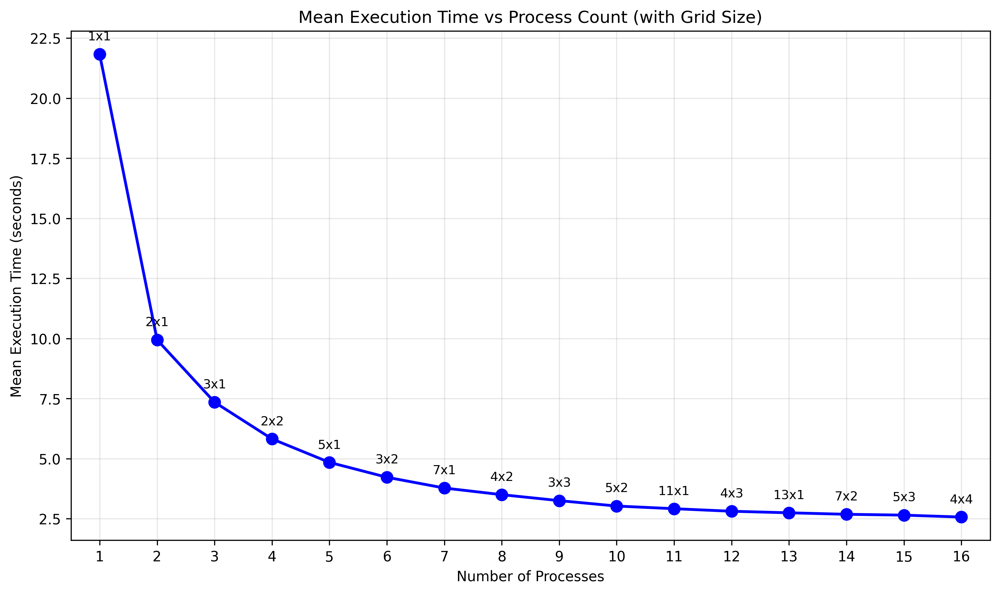
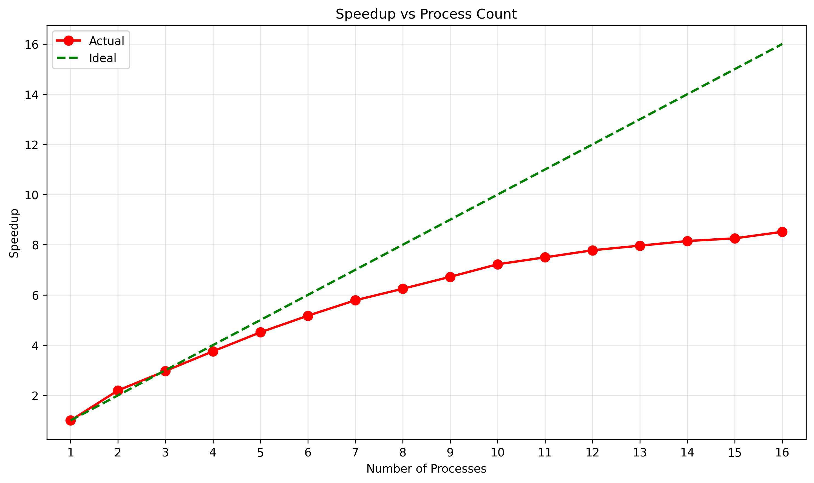

# HPC Project: 2D Cartesian Grid Topology with MPI

## Project Overview

This project implements a parallel computing solution using MPI (Message Passing Interface) to create and work with a 2D Cartesian grid topology. The implementation includes performance benchmarking, data visualization, and comprehensive testing across different process counts.

This project is related to the course on High Performance Computing, the assignment details can be found in [`assignement.md`](assignement.md).

## Project Structure

```
hpc_project/
|
├── README.md                   # This file
├── assignement.md              # Original project assignment
├── csv_schema.md               # Documentation for CSV output format
|
├── project.py                  # Main MPI implementation
├── project_changed.py          # Enhanced version (look after)
├── plot_results.py             # Image analysis based on CSV data
├── project_comparison.py       # Comparison partial script between for loop and no loop
│
├── submit/                     # Job submission scripts
├── images_changed/             # Directory for plot images of enhanced project_changed.py results
├── images_original/            # Directory for plot images of main project.py 
|
├── changed__mpi_timing_results.csv   # CSV output for enhanced project_changed.py
├── mpi_timing_results.csv            # CSV output for main project.py
|
└── hydra_output_results_original.txt  # Hydra output for main project.py
```

## Core Components

### Main Implementation Files

#### [`project.py`](project.py)

The primary MPI implementation, accounting with assignment requirements:

- **2D Cartesian Grid Creation**: Uses `MPI.Compute_dims()` and `Create_cart()` to establish a 2D process topology
- **Rank Comparison**: Compares global (`MPI_COMM_WORLD`) vs local (Cartesian) ranks
- **Neighbor Communication**: Calculates averages with neighboring processes (N, S, E, W)
- **Sub-communicator Creation**: Creates row and column communicators for collective operations
- **Performance Timing**: Measures and records execution time
- **CSV Output**: Saves timing results to `mpi_timing_results.csv`

#### [`project_changed.py`](project_changed.py)

Enhanced version of the main implementation that adds:

- **Matrix Creation and Distribution**: Creation of a NxN matrix and distribution of across processes. (Columns are distributed to each process)
- **Complex Matrix Assignments**: Each process initializes the received matrix with computationally intensive numerical operations
- **Computation Time Tracking**: Separates computation time acquired from total execution and matrix assignment time (heavy computation)
- **Extended CSV Schema**: Includes both execution and computation time metrics in output

### Performance Analysis

#### [`plot_results.py`](plot_results.py)

Comprehensive visualization script that generates:

- **Performance vs Process Count**: Line plots showing scaling behavior
- **Speedup Analysis**: Calculates and plots parallel speedup metrics
- **Scatter Analysis**: Shows task distribution and timing variance
- **Execution vs Computation Time**: Compares total runtime with pure computation time
- **Configurable Analysis**: Allows different reference points for speedup calculations

#### [`csv_schema.md`](csv_schema.md)

Documents the CSV output format with fields.

### Job Submission System

#### Submit Scripts (`submit/`)

- **Individual Scripts**: `script_job_N.sh` for N processes (1-16)
- **Batch Submission**: Scripts for submitting multiple jobs at once

Uses PBS job scheduler with requiring always the maximum number of processes (16) for guaranteed no interference from other jobs.

## Algorithm Implementation (assignment requirements)

### 1. MPI Initialization and Grid Setup

```python
# Create 2D Cartesian grid
dims = MPI.Compute_dims(world_size, 2)
cart_comm = world_comm.Create_cart(dims, periods=(True, True), reorder=True)
```

Since reordering is enabled, the world rank and Cartesian rank may differ between processes. When reordering is enabled, MPI can reassign process ranks to optimize communication patterns based on the physical topology of the hardware. However, since this implementation runs on a single node where all processes share the same physical location, the Cartesian ranks remain the same as the world ranks, regardless of whether reordering is enabled or disabled.

### 2. Neighbor Communication

EXAMPLE: Exchange with NORTH neighbor (axis=0, displacement=-1)

```python
# This communicates with the rank above in the grid
src_north, dst_north = cart_comm.Shift(0, -1)  # Get north neighbor ranks
cart_comm.Sendrecv(
    sendbuf=my_buf[0:1],        # Send my cart_rank to north neighbor
    dest=dst_north,             # Destination: north neighbor
    recvbuf=nbr_buf[0:1],       # Receive north neighbor's rank into index 0
    source=src_north            # Source: north neighbor
)
```

### 3. Sub-communicator Operations

```python
# Create row and column communicators
row_comm = cart_comm.Sub([True, False])   # Keep rows
col_comm = cart_comm.Sub([False, True])   # Keep columns

# Perform collective operations within rows/columns
row_comm.Allreduce(local_data, row_result, op=MPI.SUM)
```

## Performance Features

### Scaling Analysis

- Tests process counts from 1 to 16
- Measures execution time vs parallelization overhead
- Calculates parallel metrics

### Data Collection

- Automated CSV logging of all runs
- Timestamp tracking for experiment management
- Grid dimension recording for problem size analysis

### Visualization

- Multiple plot types for different analysis perspectives
- Configurable speedup reference points
- High-resolution output for presentations

## Results and Output

The **project.py** implementation follows the assignment specifications, serving as a solid foundation for solving the MPI problem of parallelism. While it does not provide an optimal time output, it demonstrates correct parallel computation, as verified by the results stored in the [hydra output file](hydra_output_results_original.txt).

In this implementation, the computational workload is trivial and lightweight. As a result, the total computation time is very low and it is difficult to observe how it scales with the number of processes: increasing the number of processes leads to more ranks participating in the averaging operation, which should increase the overall runtime (more communication, synchronization and more elements to average). The real relationship is illustrated in the following images:



Since the computation time is negligible, the speedup is not representative of the performance of the algorithm.



The **project_changed.py** implementation enhances the original by introducing a more complex computational task and parallelized on all the tasks, allowing for a deeper analysis of performance scaling and computation time.

The creation of a NxN matrix and its distribution across processes allows for a more realistic workload, leading to more significant differences in execution time as the number of processes increases. Also the addition of heavy computation on sub-matrices assignments on each process, proportional to matrix size, allows for a more accurate representation of the performance of the algorithm. Finally, a matrix reduction reconverting the sub-matrices into a single float value allow to keep the same average operation of the original implementation.

The results of the enhanced implementation are more representative of the performance of the algorithm, as shown in the following images:



